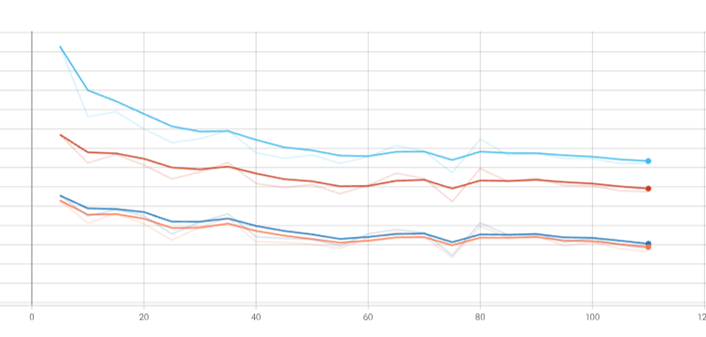
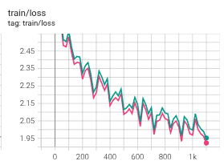
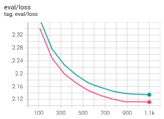
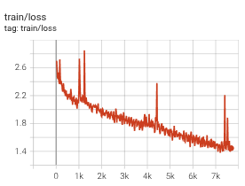
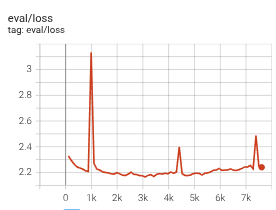

# BMW Press Release Language Model Fine-Tuning

**AI Infrastructure / Foundation Models**

Author: Jinho Kim
Date: 24.02.2026

------------------------------------------------------------------------

# 1. Executive Summary

A lightweight end-to-end pipeline that:

1. Crawls BMW press releases from the official press website
2. Preprocesses and structures data for language model fine-tuning
3. Fine-tunes GPT-2 Large with LoRA on the collected data
4. Evaluates and compares model variants (base, FT_full, FT_M1B)

The focus is on technical correctness, clarity, and reproducibility rather than maximizing model accuracy.

------------------------------------------------------------------------

# 2. Project Structure

```
├── config/config.yaml                  # Pipeline configuration (paths, hyperparameters, workflow steps)
├── database/ (gitignored)              # Raw/processed data, prompts, QnA pairs
├── src/
│   ├── bmw_01_article_crawler.py       # Web crawler
│   ├── bmw_02_data_prepare.py          # Data preprocessing
│   ├── bmw_03_llms_FT.py              # Fine-tuning
│   ├── bmw_04_llms_eval.py            # Evaluation
│   ├── logger.py                       # Structured logger
│   └── utils.py                        # Shared utilities
├── logs/ (gitignored)                  # Timestamped execution logs
├── results/ (gitignored)              # Checkpoints, eval results, generated samples
├── ipynb/                              # Notebooks for EDA, development, and visualization
└── main.py                             # Entry point — runs workflow steps from config
```

------------------------------------------------------------------------

# 3. End-to-End Workflow

`main.py` reads `config.yaml` and executes the specified pipeline steps in sequence. Users can selectively run only specific stages (e.g., skip crawling, run only fine-tuning and evaluation).

------------------------------------------------------------------------

# 4. Data Pipeline

## Crawling — `bmw_01_article_crawler.py`

**Source:** https://www.press.bmwgroup.com/global/ (text-based press releases only)

1. `expand_all_articles()` — Scrolls and clicks "Show more" until the target article count is reached
2. `crawl_articles()` — Extracts title, article_id, and URL from the page
3. `extract_details()` — Visits each article page to collect date, category, teaser, and body
4. `run_crawler()` — Orchestrates the above and saves to database

## Preprocessing — `bmw_02_data_prepare.py`

Cleans noise and boilerplate from raw articles. Concatenates `<Title>`, `<Teaser>`, and `<Text>` into a single field `"x"` for fine-tuning input.

------------------------------------------------------------------------

# 5. Model Fine-Tuning — `bmw_03_llms_FT.py`

**Model:** GPT-2 Large — balances performance and memory (~7–8 GB VRAM on RTX 4070 Ti 12 GB).
- Trianing hyper-parameters:
  - Epochs: 10
  - Batch size: 1
  - Learning rate: 5e-5
  - fp16: True (mixed precision)

**Method:** Low-Rank Adaptation (LoRA) for parameter-efficient fine-tuning.

**Model variant:** A modified architecture (FT_M1B) discards the last transformer layer to evaluate the effect on performance. The full-depth model is labeled FT_full.

| | Split |
|---|---|
| Training | 90% |
| Validation | 10% |

A fixed random seed ensures reproducibility across runs.

------------------------------------------------------------------------

# 6. Evaluation — `bmw_04_llms_eval.py`

Three models are compared: base GPT-2 Large, FT_full, and FT_M1B.

1. **Text generation** — BMW-related prompts; evaluated qualitatively for relevance, coherence, and accuracy.
2. **QnA** — 20 QnA pairs (generated by GPT-5.2 from the collected articles); evaluated with BERTScore.

Training loss is monitored via TensorBoard. 

------------------------------------------------------------------------

# 7. Results

### GPT-2 vs. GPT-2 Large

Figure 1 shows that GPT-2 Large significantly outperforms GPT-2, confirming that model size matters. From top to bottom: GPT-2+FT_M1B (sky blue), GPT-2+FT_full (red), GPT-2 Large+FT_M1B (dark blue), GPT-2 Large+FT_full (orange).



*Figure 1. Training and validation loss curves for GPT-2 vs. GPT-2 Large (FT_full and FT_M1B variants shown).*

### Trainable Parameters (LoRA)
LoRA hyper-parameters:
- r = 16
- alpha = 32
- dropout = 0.05
- target_modules = ["c_attn"]

Both variants train ~0.38% of total parameters — the layer removal has negligible effect on parameter count.

- **FT_full:** `2,949,120 / 755,786,240 (0.3796%)`
- **FT_M1B:** `2,867,200 / 775,504,640 (0.3786%)`

### FT_full vs. FT_M1B — Loss

FT_full (Magenta) achieves lower train/validation loss than FT_M1B (Green).

 

*Figure 2. Training and validation loss curves for FT_full vs. FT_M1B.*

Except for BERTScore recall, FT_full outperforms FT_M1B across all metrics, suggesting that the last transformer layer contributes to overall performance.


*Table 1. BERTScore on QnA evaluation of training shown in Figure 2*
| model | nll | bert_p | bert_r | bert_f1 |
|---|---:|---:|---:|---:|
| base | 3.8015 | 0.7042 | 0.7647 | 0.7325 |
| FT_full | **2.9150** | **0.7163** | 0.7615 | **0.7379** |
| FT-M1B | 3.0098 | 0.6988 | **0.7649** | 0.7295 |

The full evaluation report is provided in `published-results/sample_result/report_inference.md`.

### Trade-offs

*Table 2. GPT-2 vs. GPT-2 Large*
| Model | Performance | Training Speed | Model Size |
|---|---|---|---|
| GPT-2 | Low | Fast | Small |
| GPT-2 Large | High | Slow | Large |

*Table 3. FT_full vs. FT_M1B*
| Variant | Performance | Training Speed | Model Size |
|---|---|---|---|
| FT_full | High | Similar | Large |
| FT_M1B | Medium | Similar | Small |

### Overfitting

Overfitting appears beyond ~15 epochs on this small dataset; training is capped at 10 epochs.

 

*Figure 3. Overfitting behavior in training and validation loss.*

------------------------------------------------------------------------

# 8. Discussion and Outlook

**Why is training speed similar despite FT_full having more parameters?**
LoRA reduces trainable parameters to ~1.4M for both variants; the difference between them is negligible.

### Limitations
- Model performance was not the primary optimization target.
- The E2E workflow could benefit from further modularization.

### Outlook
- **RAG** for QnA — retrieve relevant article passages before generating answers.
- **MLOps integration** — MLflow for experiment tracking; Prometheus/Grafana for real-time monitoring.

------------------------------------------------------------------------

# 9. Quick Start
[NOTE] This project was built on a Linux environment with an NVIDIA RTX 4070 Ti GPU. Adjustments may be needed for other setups.
```bash
# 1. Create and activate environment
conda create -n bmw_llms python=3.10 -y
conda activate bmw_llms

# 2. Install dependencies
pip install -r requirements.txt

# 3. Configure pipeline
#    Edit config/config.yaml to select workflow steps and hyperparameters

# 4. Run
python main.py

# 5. Results are saved to results/
```